# HTML5 #

## 1.1 介绍 ##

[百度百科](https://baike.baidu.com/item/html5/4234903)

&emsp;&emsp;HTML5是HTML4的升级版

&emsp;&emsp;HTML5新增了和优化了
- 新的语义化标签
- 本地存储功能
- 多媒体功能
- 画布功能
- 新的javascript的API
- 浏览器本地应用功能
- CSS3

&emsp;&emsp;日常我们所说的HTML5其实就是一个统称，他其实包含了

> HTML5 = 新的标签 + css3 + 新的javascript API

# H5第一天 #

- 理解

    - 理解和使用盒子模型的內减模式
    - 理解和设置常见边框圆角
    - 掌握线性渐变的设置
    - 理解和使用过渡属性实现常见效果
    - 理解和使用2d转换实现常见效果

## 1.內减模式 ##
- 在CSS3中，计算盒子宽度的方式分为两种：1 传统模式 2 內减模式

- 两者的区别主要是体现在计算元素的宽度或者高度的方式上。通过 box-sizing 属性来控制


> #### 传统模式 #####

- 我们一直在写的元素的盒子模型，默认就是传统模式  box-sizing: content-box;

- 盒子的宽度计算方式为：

    - 传统模式 宽度计算 ： 盒子的宽度 = css中设置的 width + border +padding
    - 內减模式 宽度计算 ： 盒子的宽度  = css中设置的宽度 width 属性值为 boder-box


> ### 內减模式 ###
> 
- 观察得出： 內减模式的特点
    - 元素真实的宽度就是css中设置的宽度
    - 当css中的width定好了之后，动态的改变border或者padding，只有内容的宽度见减少

- 应用场景
    - 常用在样式的初始化中，避免一个像素之差导致的布局换行


## 2.过渡 transition ##

过渡就好像是jquery中的animate方法一样，可以看到元素的变化的整个过程。

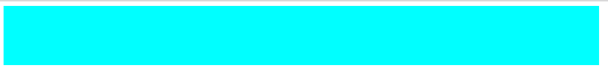

如想要看到div的宽度由1000px变为100px的过程
&emsp;1.给div的宽度添加过渡属性：transition-property: width;

&emsp;2.设置过渡持续时间：transition-duration:3s;

&emsp;3.鼠标移入div即可。

```css
div {
      width: 1000px;
      height: 100px;
      background-color: aqua;
      /* 要过渡的属性 width*/
      transition-property: width;
      /* 过渡的持续时间 3s*/
      transition-duration: 3s;
    }

    div:hover{
      width: 100px;
    }
```

语法

 完整的参数设置如下
 

 **1.要过渡的属性**

 > 如width，height  transition-property: width;   写all代表全部

 **2.持续时间**
 > 设置过渡的持续时间 如:transition-duration:10s

 **3.速度曲线**

 - 设置变化的速度曲线 如匀速等  

    - linear： 匀速
    - ease： 慢-快-慢  默认值
    - ease-in： 慢-快。
    - ease-out： 快-慢。
    - ease-in-out： 慢-快-慢。

**4.延迟时间**

&emsp;&emsp;设置产生过渡时的延迟时间 如   transition-delay: 10s;

### 2.1 复合写法 ###

&emsp;&emsp;可以使用复合写法

```css
/* 过渡的属性为width 持续3s 匀速 延迟0s */
transition: width 3s linear 0s;
```

### 2.2 多个过渡写法 ###

&emsp;&emsp; 可以同时对一个元素的多个元素添加过渡 对宽度和高度设置不同的过渡

```css
transition: 
    width 1s ease-in 1s,
    height 10s ease-in-out 2s;
```

### 2.3 过渡结束事件 ###

&emsp;&emsp; 元素在执行过渡结束之后，会自动触发的事件 **transitionend**

```js
var div = document.querySelector("div");
div.addEventListener("transitionend", function () {
    console.log("div的过渡结束之后，触发");
})
```

## 3.2D转换(变化) **transform** ##

2d转换是改变标签在2维平面上的位置和形状的一种技术，先来学习2维坐标系


### 3.1 2d移动 **translate** ###

2d移动是2d转换里面的一种功能，可以改变元素在页面中的位置，类似 定位

使用2d移动的步骤：

1.给元素添加 **转换属性** `transform`
2.属性值为 `translate(x,y)` 如
`transform:translate(50px,50px);`

```css
div{
    transform: translate(50px,50px);
}
```


### 3.2 小结 ###
1. **translate** 中的百分比单位是相对于自身元素的 `translate:(50%,50%);`
2. **translate** 类似定位，不会影响到其它元素的位置
3. 对行内标签没有效果

## 4.2d旋转 rotate ##

2d旋转指的是让元素在2维平面内顺时针旋转或者逆时针旋转

使用步骤：

1.给元素添加转换属性`transform`
2.属性值为 `rotate(角度)`  如 `transform:rotate(30deg)`  顺时针方向旋转30度

```css
div{
      transform: rotate(0deg);
}
```

在浏览器中手动修改


观察过后，2d旋转有以下特点
1.角度为正时 顺时针 负时 为逆时针
2.默认旋转的中心点是元素的中心点

### 4.1 转换中心 transform-origin 了解 ###

该属性可以修改元素旋转时候的中心点

&emsp;1.transform-origin:50% 50%;  默认值  元素的中心位置 百分比是相对于自身的宽度和高度

&emsp;2.transform-origin:top left;  左上角   和 transform-origin：0 0;相同

&emsp;3.transform-origin:50px 50px;  距离左上角 50px 50px 的位置

&emsp;4.transform-origin：0;  只写一个值的时候  第二个值默认为 50%;

## 5.2d缩放scale ##
缩放，顾名思义，可以放大和缩小。 只要给元素添加上了这个属性就能控制它放大还是缩小 

步骤

- 给元素添加转换属性 `transform`
- 转换的属性值为 `scale(宽的倍数,高的倍数)`    如 宽变为两倍，高变为3倍 `transform:scale(2,3)`


## 6.小结 ##
- transform:scale(1,1) 放大一倍 相对于没有放大
- transform:scale(2,2) 宽和高都放大了2倍
- transform:scale(2)  只写一个参数 第二个参数则和第一个参数一样 相当于 scale(2,2)
- transform:scale(0.5,0.5)  缩小
- transform:scale(-2,-2) 反向放大2倍    很少用负数 容易让人产生误解

# H5第二天 #

> 学习目标

- 理解
    - 3d转换中的3d移动,3d旋转
    - 动画属性的设置和使用
    - animate.css 动画库的使用
- 应用
    - 实现3d立方体
    - 无缝滚动
    - 正在等待图标的制作
    - 自己实现animate.css

## 1   3d转换(变化) ##

3d转换时改变标签在3坐标系上的位置和形状的一种技术，以下知识点最好结合 [3d模型工具来理解](./3d演示工具.html)

> 维坐标系

3维坐标系其实就是指立体空间，立体空间是由3个轴共同组成的
- x轴 水平向右
- y轴 垂直向下
- z轴 垂直屏幕 由屏幕里面指向屏幕的外面
  

> 3d移动 translate3d

3d移动在2d移动的基础上加了一个可以移动的方向，就是z轴方向

- 语法：

    1.transform:translate3d(x,y,z) 其中x y z 分别指要移动的轴的方向距离

    2.transform:translateX(100px) 仅仅是移动在x轴上移动

    3.transform:translateY(100px) 仅仅是移动在y轴上移动

    4.transform:translateZ(100px) 仅仅是移动在z轴上移动

- 注意：

    因为z轴是垂直屏幕，由里指向外面，所以默认是看不到元素在z轴的方向上移动，想要看到，可以使用下面的视距属性设置

>视距 perspective 了解

&emsp;&emsp;人在看物体时，有个规律，如远的物体看起来小 近的物体看起来大

perspective 就是用来设置 人 和 物体 的距离

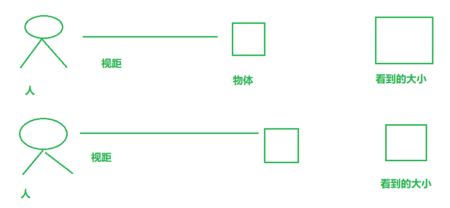


如 我们想要看到 物体 在轴上的移动的远大近小效果时

&emsp;&emsp;1.设置物体的translateZ一般大于0 如transform:translateZ(100px)

&emsp;&emsp;2、设置 人和物体的距离-视距 这个值规定要设置给物体的父元素 perspertive:1000px

&emsp;&emsp;3、动态改变物体的 translateZ 即可观察效果

```css
/* 父元素 */
body {
    /* 视距 */
    perspective: 1000px;
}

/* 目标 */
div {
    width: 200px;
    height: 200px;
    background-color: aqua;
    margin: 100px auto;
    /* z轴的移动 */
    transform: translateZ(0px);
}
```


> 小结

&emsp;&emsp;1.translateZ的值和perspertive都要大于0否则容易出现兼容性问题

> 3d旋转 *rotate3d*

3d旋转指可以让元素在3维平面内沿着 x轴，y轴，z轴或者自定义轴进行旋转  对于元素旋转的方向的判断 我们需要先学习一个左手准则


#### 1.1 例子 #####

我现在想让元素沿着 x轴正方向旋转90度

```css
 /* 沿着x轴正方向旋转90度 deg为单位 */
transform: rotateX(90deg);
```

可以通过自己的代码测试 让物体沿着y轴 z轴旋转，加深了解。

####1.2  语法####

- `transform:rotateX(45deg);` 沿着x轴正方向旋转 45度
- `transform:rotateY(45deg)` 沿着y轴正方向旋转 45deg
- `transform:rotateZ(45deg)` 沿着Z轴正方向旋转 45deg
- `transform:rotate3d(x,y,z,deg)` 沿着自定义轴旋转 deg为角度  了解即可

## 2  3D缩放scale3d了解 ##

3d缩放 可以控制元素 在 x轴，y轴，z轴上的缩放，也可以理解为 宽，高，厚度的缩放。 结合3d模型工具学习

#### 2.1 语法 ####
- `transform: scale3d(1 ,1,2);`  宽，高 缩放一倍，厚度放大两倍
- `transform: scaleX(1)` 只缩放宽
- `transform: scaleY(1)` 只缩放高
  -` transform: scaleZ(1)` 只缩放厚  

## 3  视距原点 perspective-origin 了解 ##

回顾视距知识点，

视距可以设置 人 和 物体 之间的距离 也就是z轴方向的距离   

而  视距原点 可以设置 人 站在x轴和y轴的位置。


- 视距原点和视距一样，也是设置给要观察元素的**父元素**上
- perspective-origin:center center; 默认值是**元素的中心点**
- perspective-origin:10px；  指定了一个参数的时候，第二个参数默认为center 也就是50%；
- perspective-origin:10% 10%； 百分比都是相对于自身的宽度和高度

## 4  transform-style 了解 ##
结合3d立方体案例理解，控制子元素是否开启3维立体环境

- `transform-style: flat; ` 平面模式  -  不开启3维立体环境
- `transform-style: preserve-3d;`  3维立体环境

## 5  3D转换总结 ##

- 百分比单位都是相对于自身
- 视距、视距原点、转换样式 这三个属性都是给**父元素**添加的

## 6 动画 animation ##

初学者容易对**动画**和**过渡**傻傻分不清楚

过渡 只能看到一次变化过程 如 宽度**1000px**变化到**100px**

**动画**可以设置变化的次数 **甚至是无数次**   

### 6.1 步骤 ###

1.在css中定义动画函数  

2.给目标元素调用动画函数

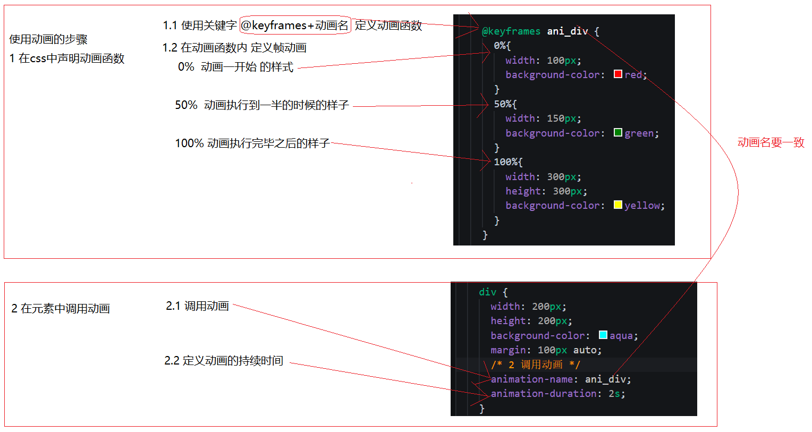

```css 
 /* 1 声明动画函数 */
@keyframes ani_div {
    0%{
    width: 100px;
    background-color: red;
    }
    50%{
    width: 150px;
    background-color: green;
    }
    100%{
    width: 300px;
    height: 300px;
    background-color: yellow;
    }
}

div {
    width: 200px;
    height: 200px;
    background-color: aqua;
    margin: 100px auto;
    /* 2 调用动画 */
    animation-name: ani_div;
    /* 持续时间 */
    animation-duration: 2s;
}
```

### 6.2 语法 ###
> 1.动画名
> 设置要使用的动画名 `animation-name:xxx;`
> 》

2.持续时间
设置动画播放的持续时间 `animation-duration:3s`

3.速度曲线
和设置过渡的速度曲线一样 `animation-timing-function:linear;`

- linear： 匀速
- ease： 慢-快-慢  默认值
- ease-in： 慢-快。
- ease-out： 快-慢。
- ease-in-out： 慢-快-慢。

4.延迟时间

`animation-delay: 0s;`

5.循环次数
设置动画播放的循环次数 `animation-iteration-count: 2;  ` **infinite**为无限循环

6.循环方向
`animation-direction`

如在动画中定义了  0%：红色  100%：黑色 那么 当属性值为 

- normal  默认值 **红 -> 黑**
- reverse 反向运行  **黑 -> 红**
- alternate  正-反-正... **红 -> 黑 -> 红...**  
- alternate-reverse  反-正-反.. **黑 -> 红 -> 黑 ...**
- 以上与循环次数有关

7.动画等待或者结束的状态
&emsp;&emsp; `animation-fill-mode`设置动画在等待或者结束的时候的状态

- **forwards:** 动画结束后，元素样式停留在100%的样式

- **backwards:** 在延迟等待的时间内，元素样式停留在0%的样式

- **both:** 同时设置了 forwards 和 backwards 两个属性值

8.暂停和播放

`animation-play-state`控制 **播放** 还是 **暂停** `running` 播放  `paused` 暂停

### 6.3 复合写法 ###

`animation: name duration timing-function delay iteration-count direction fill-mode;`

### 6.4 多个动画写法 ###

```css
animation:
name duration timing-function delay iteration-count direction fill-mode，
animation: name duration timing-function delay iteration-count direction fill-mode;
```

### 6.5 动画结束事件 **animationend** 

元素在动画结束之后，会自动触发的事件 **animationend**

```js
var div = document.querySelector("div");
div.addEventListener("animationend", function () {
    console.log("div的动画结束之后，触发");
})
```

## 7  动画库 **animate.css**

封装了常见的有意思的小动画 **发疯似的建议看官网来学习使用**

[官网](https://daneden.github.io/animate.css/)

[中文](https://www.awesomes.cn/repo/daneden/animate-css)

### 7.1 使用步骤 ###

1.引入css文件

```html
<head>
  <link rel="stylesheet" href="animate.min.css">
</head>
```

2.给元素添加对应的class
```html
<h1 class="animated infinite bounce">快来看看我</h1>
```

3.简单解读：

`animated`必须添加的class
`infinite `无限播放
`bounce `弹跳动画的效果，可以查官网自己选择喜欢的


# h5第三天 #

##1  学习目标##
- 理解
    - 伪类选择符
    - 全屏插件fullage.js 
    - css预处理器-sass
- 应用
    - **QQ浏览器**

## 2  伪类选择符 ##

伪类选择符其实我们在基础班就已经学习过一些了，看看它们的大家族


因为有些常用 有些不常用。所以我们就只学习常用的即可

### 2.1 E:first-child ###

匹配父元素的第一个子元素E。

```html
<style>
    ul li:first-child{
        background-color: red;
    }
</style>

<ul>
    <li>列表项一</li>
    <li>列表项二</li>
    <li>列表项三</li>
    <li>列表项四</li>
</ul>
```


**E:last-child** 则是选择到了最后一个li标签

### 2.2 E:nth-child(n)    E:nth-last-child(n) ###

 匹配到父元素的第n个元素 或者 是倒数第n个元素

 相比 E:first-child   则要强大了不少，功能如下 （**死记硬背是最好的**）

 - 匹配到父元素的第2个子元素  
    `ul li:nth-child(2){}`

 - 匹配到父元素的倒数第2个子元素
    `ul li:nth-last-child(2){}`

 - 匹配到父元素的序号为奇数的子元素
    `ul li:nth-child(odd){}` **odd**是关键字  奇数的意思（3个字母 ）

 - 匹配到父元素的序号为偶数的子元素 
    `ul li:nth-child(even){}` **even** (4个字母)

 - **匹配到父元素的前3个子元素**
     `ul li:nth-child(-n+3){}`

&emsp;&emsp;选择器中的  n 是怎么变化的呢？

&emsp;&emsp;因为 n是从 0 ，1，2，3.. 一直递增

&emsp;&emsp;所以 -n+3 就变成了


- 匹配到父元素的后3个子元素

`ul li:nth-last-child(-n+3){}`

### 2.3 E:nth-of-type(n) ###

这里只讲明 **E:nth-child(n)** 和 **E:nth-of-type(n)** 的区别**剩下的 **E:first-of-type** **E:last-of-type**  **E:nth-last-of-type(n)**   同理做推导即可

```css
<style>
    ul li:nth-child(2){
        /* 字体变成红色 */
        color: red;
    }

    ul li:nth-of-type(2){
        /* 背景变成绿色 */
        background-color: green;
    }
</style>


<ul>
    <li>列表项一</li>
    <p>乱来的p标签</p>
    <li>列表项二</li>
    <li>列表项三</li>
    <li>列表项四</li>
</ul>
```

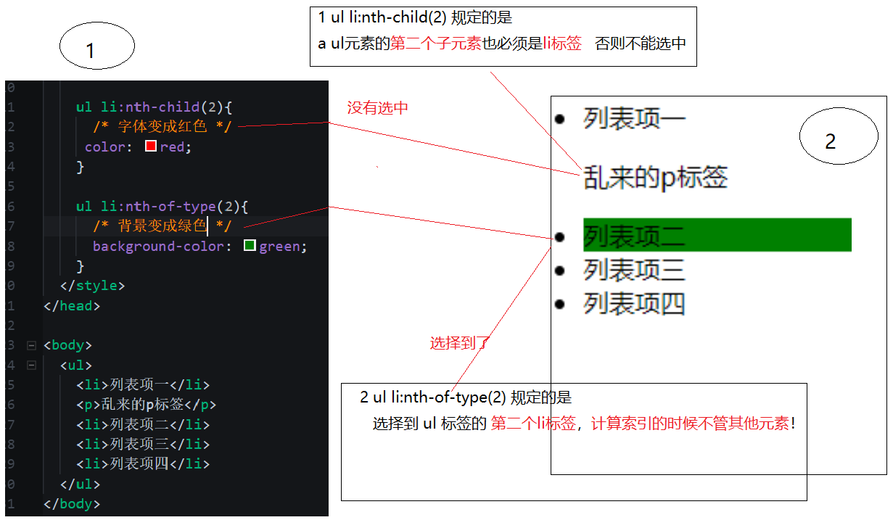

也就是说
- `E:nth-child(n)` 匹配父元素的第n个子元素E。
- `E:nth-of-type(n)` 匹配同类型中的第n个同级兄弟元素E。

## 3  fullpage 全屏插件 ##

fullPage.js 是一个基于 jQuery 的插件，它能够帮你很方便、很轻松的制作出全屏网站。

github 官网 <https://github.com/alvarotrigo/fullPage.js>

中文演示地址 <http://www.dowebok.com/demo/2014/77/>

### 3.1 引用文件 ###

```html
<link rel="stylesheet" href="css/jquery.fullPage.css">
<script src="js/jquery.min.js"></script>
<script src="js/jquery.fullPage.js"></script>
```

### 3.2 HTML 结构 ###

```html
<div id="fullpage">
    <div class="section">第一屏</div>
    <div class="section">第二屏</div>
    <div class="section">
        <div class="slide">第三屏的第一屏</div>
        <div class="slide">第三屏的第二屏</div>
        <div class="slide">第三屏的第三屏</div>
        <div class="slide">第三屏的第四屏</div>
    </div>
    <div class="section">第四屏</div>
</div>
```

### 3.3 **JavaScript** ###

```js
$(function(){
    $('#fullpage').fullpage();
});
```

### 3.4 **fullpage** 详细参数


## 4  css预处理器 ##

一套可以提高编写css代码的技术

[](https://www.sass.hk/)

### 4.1 有哪些css预处理器 ###

- less
- sass
- stylues

> ## sass的文件后缀名是scss! ##
> sass是技术的名称  scss是sass文件的后缀名

### 4.2	sass的执行过程 ###

- 编写符合sass语法的scss文件
- 使用工具将scss文件编译成css文件
- 页面中引用编译好的css文件

## 5  sass语法 ##

### 5.1 变量 ### 

```css
// 声明变量 $变量名:值;
$color:red;

// 使用变量
body{
  background: $color;
}
```

### 5.2 混合-函数 ###

```css
// 声明函数 .函数名(@参数名)
@mixin changeColor($c){
  background-color: $c;
}

// 使用函数
body{
  @include changeColor(red);
}
```

### 5.3 嵌套--注意层级问题 ###

```css
#id{
  .c1{
    // 后代
    a{}
    // 子代
    >p{}
    // 伪元素
    &:before{}
  }
}
```

### 5.4 导入 ###

a.scss

```css
body{
  background-color: red;
}
```

b.scss

```html
@import "a.scss";
```

生成b.css
```css
body {
  background-color: red;
}
```

### 5.5 注释 ###

```css
// 不会被编译
/* 会被编译 */
```

### 5.6 sass工具 ###

- [考拉编译工具 考拉官方网站](http://koala-app.com/index-zh.html)

- vs code 插件 "**Live Sass Compiler**"  在插件搜索列表中安装即可,插件安装后,重启 vs code 点击

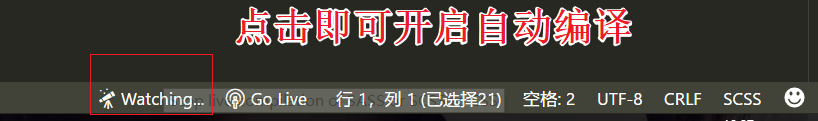 


# h5第四天 #

## 1  学习目标

- 理解
  - 弹性盒子
- 应用
  - 携程旅游案例

## 2  flex弹性布局

- 传统布局 兼容性好  但是繁琐
- 弹性布局  操作方便  主要用于移动端
- 伸缩布局=弹性布局=伸缩盒子=弹性盒子=flex布局

## 3  初体验

1. 给父盒子 div 设置 `display:flex;`，即可将其变为弹性布局
2. 子元素span可以随意设置宽高，不再受显示模式的限制(如行内span元素也可以设置宽高)

```css
<style>
    * {
      margin: 0;
      padding: 0;
      box-sizing: border-box;
    }
    div {
      width: 600px;
      height: 600px;
      margin: 10px auto;
      background-color: aqua;
      /* 父项设置flex布局 */
      display: flex;
    }
    /* span做为子项 */
    span {
      background-color: pink;
      border: 1px solid #000;
      /* 子项不再分行内或者块级 直接设置宽高即可 */
      width: 100px;
      height: 100px;
    }
  </style>
</head>
<body>
  <div>
    <span>1</span>
    <span>2</span>
    <span>3</span>
  </div>
</body>
```


以下设置属性的时候，我们时分为对父元素设置和对子元素设置两种方式。

## 4  父项 

以下6个属性时对父元素设置的

1. `flex-direction`设置主轴的方向
2. `justify-content`设置主轴上子元素的排列方式
3. `flex-wrap`设置子元素是否换行
4. `align-content`设置侧轴上的子元素的排列方式(多行)
5. `align-items`设置侧轴上的子元素排列方式(单行)
6. `flex-flow`复合属性，相当于同时设置了 flex-direction 和 flex-wrap


### 4.1  flex-direction 设置主轴的方向

在flex布局中，时分为主轴和侧轴两个方向，同样的叫法有：行和列、x轴 和 y轴

- 主轴方向就是x轴方向--水平向右
- 侧轴方向就是y轴方向--水平向下


如上面的案例：子项默认就是从左到右排列的。

- **flex-direction:row;** row 就是默认值，从左到右

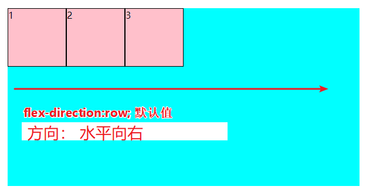

- **flex-direction:row-reverse;**从右到左


- **flex-direction:column;**从上到下


- **flex-direction:column-reverse;**从下到上


### 4.2 justify-content 设置主轴上的子元素排列方式

直接上图

- `justufgy-content:flex-start` 默认值
- `justify-content:flex-end;`从尾部开始排列，要注意与 `flex-direction-reverse;`的区别


- `justify-content:center;`挤在一起居中

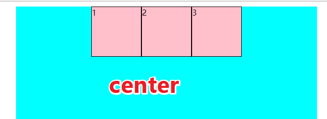

- `justify-content:space-around;`平分剩余空间


- `justify-content:space-between;`先两边再平分剩余空间


### 4.3 flex-wrap设置子元素是否换行

flex布局默认是不换行的，把span标签的个数变成100个试试

默认

> flex-wrap:no-wrap;


想要换行，只能手动指定

> flex-wrap:wrap;


### 4.4 align-content 设置侧轴上的子元素的排列方式(多行)

设置子项在侧轴上的排列方式，并且只能用于子项出现换行的情况， **在单行下是没有效果的！**

- align-content:flex-start;在侧轴的头部开始排列


- align-content-end;在侧轴的尾部开始排列


- align-content:flex-center;在侧轴中间显示

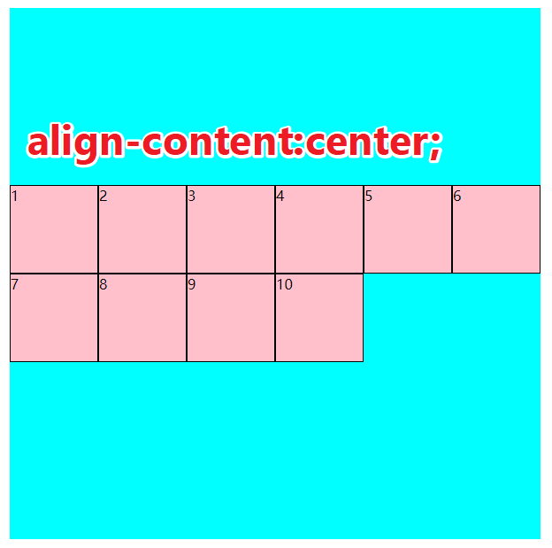

- align-content-around;子项在侧轴平分剩余空间


- align-content:space-between;子项在侧轴，先分布在两头，再平分剩余空间

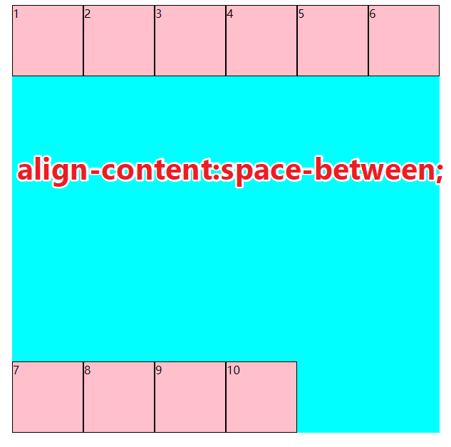

- align-content:stretch;设置子项元素高度平分父元素高度(当子项设了高度的时候--无效)

  在css中先把子项高度去掉

  ```css
   /* 为了让 父项的align-content:stretch;有效 注释 子项的高度 */
   /* height: 100px; */
  ```

  在父项中加入

  ```css
  /* 子项高度平分父元素的高度*/
  align-content:stretch;
  ```

  

- align-content:normal;默认值

### 4.5 align-items 设置侧轴上的子元素排列方式(单行)

该属性是控制子项在侧轴(默认是y轴)上的排列方式，在子项为单项的时候使用

它的参数意思可以参照之前的解释

- align-items:flex-start;
- align-items:flex-end;
- align-items:center;
- align-items:stretch;

### 4.6 align-content和align-items的区别

1. align-items可以用于单行和多行，但是设置多行的参数没有align-content多
2. align-content只能用于多行，不能用于单行
3. 为了方便记忆，可以记为字母数少的设置单行，字母多的设置多行

## 5 子项

### 5.1 align-self控制子项自己在侧轴上的排列方式

**align-self的优先级比align-items,align-content高**

1. - 在父项上设置:侧轴子项排列方式居中 `align-items:center;`
2. 在第二个子项上，设置自己在侧轴上的排列方式`align-self:flex-end;`

```css
<style>
    * {
      margin: 0;
      padding: 0;
      box-sizing: border-box;
    }

    div {
      width: 600px;
      height: 600px;
      margin: 10px auto;
      background-color: aqua;
      display: flex;
      /*父元素 设置侧轴子项排列方式 居中 */
      align-items: center;
    }
    span {
      background-color: pink;
      border: 1px solid #000;
      width: 100px;
      height: 100px;
    }
    span:nth-child(2) {
      /* 设置自己在侧轴上的排列方式 */
      align-self: flex-end;
    }
  </style>
</head>
<body>
  <div>
    <span>1</span>
    <span>2</span>
    <span>3</span>
  </div>
</body>
```


其它参数的设置如下

1. 参数基本和align-items一样
2. flex-start
3. flex-end
4. center
5. stretch

### 5.2 order 设置子项之间的排列顺序

默认值都是0，谁的order值越小，谁就越靠前


### 5.3 flex 设置子项宽度占父元素宽度的比例

**当子项指定了width时无效**

例子一

设置  **每一个子项父元素的宽度**

```css
 <style>
    * {
      margin: 0;
      padding: 0;
      box-sizing: border-box;
    }
    div {
      width: 600px;
      height: 600px;
      margin: 10px auto;
      background-color: aqua;
      display: flex;
    }
    span {
      background-color: pink;
      border: 1px solid #000;
      height: 100px;
      /* 不要指定width属性 */
      /* width: 100px; */
      flex: 1;
    }
  </style>
</head>

<body>
  <div>
    <span>1</span>
    <span>2</span>
    <span>3</span>
  </div>
</body>
```

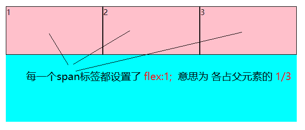

**计算方式**

当设置子项的`flex:1;`时，假设有n个子项，每一个子项各占父元素的 **1/n**

> 子项的宽度 = 父元素宽度 *（ 子项的flex / 总的flex数 ） 
>
> = >
>
> 子项的宽度=父元素宽度 *（1 / n） 


例子二

假设一共有三个子项，第一个子项设置`flex:2`其他都为`flex:1`第一个子项的宽度应该是其他子项的两倍

```css
<style>
    * {
      margin: 0;
      padding: 0;
      box-sizing: border-box;
    }
    div {
      width: 600px;
      height: 600px;
      margin: 10px auto;
      background-color: aqua;
      display: flex;
    }
    span {
      background-color: pink;
      border: 1px solid #000;
      height: 100px;
      /* 不要指定width属性 */
      /* width: 100px; */
      flex: 1;
    }
    span:nth-child(1){
      flex: 2;
    }
  </style>
</head>

<body>
  <div>
    <span>1</span>
    <span>2</span>
    <span>3</span>
  </div>
</body>
```


### 5.4 其他

1. flex-grow 了解即可，可以自行查 css.chm文档
2. flex-shrink 了解即可 了解即可  可以自行查 css.chm 文档
3. flex-basis 了解即可 了解即可  可以自行查 css.chm 文档

## 6 弹性布局小结

- 子项可以直接设置宽度和高度

- 子项不受浮动影响，但是受定位影响

- 在移动端布局时，传统布局和弹性布局，哪种方便就使用哪种。

  ​


# h5  第5天

## 1  学习目标

- 理解
  - 阴影
  - 颜色
  - 伪类选择器
  - 属性选择器
  - 背景
  - 字体
  - h5语义化标签
  - h5表单标签 属性和事件
- 引用
  - 凹凸字体
  - 增大背景图片的响应区域
  - h5完整表单

## 2  阴影

在 css3 中，阴影分为两种，一种是盒子阴影，一种是文字阴影

### 2.1  盒子阴影  **box-shadow**

顾名思义，就是为一个盒子添加阴影效果，如：

```css
li {
  float: left;
  width: 200px;
  height: 200px;
  border: 1px solid #ccc;
  list-style: none;
  background: url("./img/timg.jpg");
  background-origin: content-box;
  background-repeat: no-repeat;
  background-size: 100%;
  padding: 20px;
 }

li:hover {
  /* 盒子阴影 水平偏移 垂直偏移 模糊值 阴影外延值 内外阴影？ */
  box-shadow: 1px 1px 12px 1px;
}
```


#### 2.1.1  语法1

box-shadow: 水平偏移，垂直偏移，模糊值，外延值，颜色，内外阴影

1. **水平偏移**--单位px或者%
2. **垂直偏移**--单位px或者%
3. **模糊值**--控制阴影的模糊程度，值越大越模糊，单位px
4. **外延值**--控制阴影向外延伸的值，单位px
5. **内外阴影**--可以省略，省略值为inset（内阴影）   outset（外阴影）

#### 2.1.2  语法2

可以对一个盒子添加多个阴影，如

```css
/* 盒子阴影 水平偏移 垂直偏移 模糊值 阴影外延值 内外阴影？ */
box-shadow: 50px 50px 25px 3px red,
		   -50px -50px 25px 3px yellow;
```

### 2.2  文本阴影 **text-shadow**

为文本添加阴影效果，如

```css
p:nth-child(1) {
  /* 文字阴影 水平偏移 垂直偏移 模糊值 颜色 */
  text-shadow: -1px -1px 1px #000,1px 1px 1px #fff;
}
p:nth-child(2) {
  /* 文字阴影 水平偏移 垂直偏移 模糊值 颜色 */
  text-shadow: -1px -1px 1px #fff,1px 1px 1px #000;
}
```


2.2.1  语法

文本阴影的属性值比盒子阴影的要少两个，少了 **外延值**和 **内外阴影**其他都一样

**text-shadow: 水平偏移 垂直偏移 模糊值  颜色**

## 3  颜色(rgba)

关于颜色的设置，有以下几种，我们主要学习 **RGBA** 其他只需要了解即可

 **RGBA** 比  **RGB** 多了一个透明度，那么 **RGBA** 的效果和 **RGB** + **opacity** 的效果一样吗？

答案： **不一样**

- RGBA  中的透明度 只是背景透明 而内容不透明
- 而 opacity  会 把元素的所有都变成透明 

## 4  背景

背景 **background**一共拥有8个属性

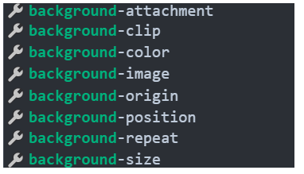

先从最简单的开始  学习&复习

1. `background-color:`指定背景颜色
2. `background-image:`  指定要使用的背景图片 或者  **渐变**
3. `background-repeat:`  设置背景图片的平铺方式 
4. `background-attachment:` 设置背景图像是随对象内容滚动还是固定的  默认是滚动
5. `background-position:` 设置背景图片的偏移值 

那么 还剩下三个需要我们重点讲解的   **size** 、**origin**  和 **clicp**

### 4.1 background-size

设置背景图片的大小，有两种设置方法，一种是自定义，如`background-size:100px 100px`

**另外一种就是系统提供的值（重点学习）**

- cover 等比放大到容器大小，直到最短边触底
- contain 等比放大到容器大小，直到最长边触底


```css
<style>
    * 公共样式 */
    div { width: 200px; height: 200px; display: inline-block; margin: 10px; border: 1px solid #000; background-image: url("./1.png"); background-repeat: no-repeat; }

    div:nth-child(1) {
      /* 默认值 相当于不设置 */
      background-size: auto;
    }

    div:nth-child(2) {
      /* 等比放大到容器大小，直到最短边触底 */
      background-size: cover;
    }

    div:nth-child(3) {
      /* 等比放大到容器大小，直到最长边触底 */
      background-size: contain;
    }
  </style>
</head>

<body>
  <div></div>
  <div></div>
  <div></div>
</body>
```

### 4.2  background-origin

设置背景图片从哪里开始显示，我们把一个元素分为三个部分 **border**、**padding**、**content-width** 这个属性就是用来设置背景图片，三个部分开始显示的


```css
<style>
    /* 公共样式 */
    div { width: 200px; height: 200px; display: inline-block; box-sizing: border-box; margin: 10px; background-image: url("./1.png"); background-repeat: no-repeat; background-color: red; border: 10px dashed #000; padding: 30px; }

    div:nth-child(1) {
      /* 从padding部分开始显示 */
      background-origin: padding-box;
    }

    div:nth-child(2) {
      /*从边框部分开始显示 */
      background-origin: border-box;
    }

    div:nth-child(3) {
      /* 从内容部分开始显示 */
      background-origin: content-box;
    }
  </style>
</head>
<body>
  <div></div>
  <div></div>
  <div></div>
</body>
```

### 4.3  background-clip

背景裁剪，一个元素分为三个部分**border**、**padding**、**content-width**

该属性控制背景**从哪个部分开始向外裁剪**

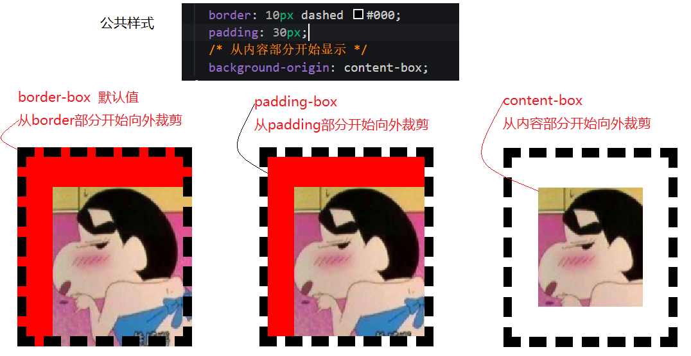

```css
<style>
    /* 公共样式 */
    div { width: 200px; height: 200px; display: inline-block; box-sizing: border-box; margin: 10px; background-image: url("./1.png"); background-repeat: no-repeat; background-color: red; border: 10px dashed #000; padding: 30px; background-origin: content-box; }

    div:nth-child(1) {
      /* 从边框部分开始显示  默认值  */
      background-clip: border-box;
    }

    div:nth-child(2) {
      /* padding-box 从padding部分开始显示  */
      background-clip: padding-box;
    }

    div:nth-child(3) {
      /* content-box 从内容部分开始显示 */
      background-clip: content-box;
    }
  </style>
</head>

<body>
  <div></div>
  <div></div>
  <div></div>
</body>	
```

### 4.4  增大背景图片响应区域

## 5  字体

我们先了解两个概念**位图**和**矢量图**

1. 位图：就是我们平常所了解的图片，如*.jpg *.png    **位图放大会变模糊**
2. 矢量图 字体可以理解是矢量图 当字体放大时，程序会自动重新渲染一次字体，所以放大 不会变模糊 

### 5.1  web字体

在网页中，有时候我们需要在网页中引用设计师自己设计的字体。

### 5.2  字体图标

字体图标的使用方式和**web字体**类似  

使用第三方字体图标实现效果

1. [font-awesome](http://fontawesome.dashgame.com/) 
2. [阿里巴巴](http://www.iconfont.cn/)

## 6  伪元素选择器了解

1. 有哪些特点

- ：：冒号
- 但标签不能加伪元素
- content:""
- 通过js或者jq拿不到伪元素
- first-letter
- first-line

2.一般用在哪里

- 字体图标
- 清除浮动

### 6.1  伪元素种类

1. E::before   在E元素前插入一个元素
2. E::after  在E元素后插入一个元素
3. E::first-letter 选择到了E容器内的第一个字母  
4. E::first-line 选择到了E容器内的第一行文本

### 6.2  h5写法和传统写法区别了解

1. 单冒号`E:before`
2. 双冒号`::before`

**结论**： 浏览器对以上写法都能识别 **双冒号** 是h5上语法的规范

## 7  属性选择符  了解

1. E[attr]选择具有attr属性的E元素。
2. E[att="val"] 选择具有att属性且属性值等于val的E元素。
3. E[att^="val"] 选择具有att属性且属性值为以val开头的字符串的E元素。
4. E[att$="val"] 选择具有att属性且属性值为包含val的字符串的E元素
5. E[att*="val"] 选择具有att属性且属性值为包含val的字符串的E元素。

```html
<!-- 
    标签
    类名
    id
    *
    子代
    后代
    属性选择符
      [class] 选择到了 具有class属性的标签 
      [class="red"] 选择到了 具有class属性并且 值 = red
      [class^="red"] 选择到了 具有class属性并且 值 是以 red开头的
                              开发样式框的人使用
                               [class^=btn]{

                               }
                                .btn-lg .btn-md 
      [class$="red"]  选择到了具有class属性 并且值以 red 结尾!!!                         
      [class*="red"]    选择到了具有class属性  并且值里面包含有 red 
   -->
  <!-- <div class> [class]</div> -->
  <!-- <div class="red"> [class="red"]</div> -->
  <!-- <div class="red-btn"> red-btn</div> -->
  <!-- <div class="red-div"> red-div</div> -->
  <!-- <div class="div-red"> div-red</div> -->
  <div class="div-red-div"> div-red-div</div>
```

```css
  <style>
    /* [class]{
      background-color: red;
      width: 200px;
      height: 20px;
    } */

    [class="red"] {
      background-color: red;
      width: 200px;
      height: 20px;
    }

    [class^="red"] {
      background-color: aqua;
      width: 200px;
      height: 20px;
    }

    [class$="red"] {
      background-color: yellow;
      width: 200px;
      height: 20px;
    }

    [class*="red"] {
      background-color: green;
      width: 200px;
      height: 20px;
    }
  </style>
```

## 8  语义化标签  了解

使用语义化标签的好处是增强了代码的可阅读性，也方便了网站的seo。

- header  头部标签
- nav 导航标签
- article 内容标签
- section 块级标签
- aside 侧边栏标签
- footer 尾部标签


## 9  h5的dom API扩展

### 9.1  h5新增两种获取dom的方式

1. 获取单个dom元素`document.querySelector("div")`
2. 获取dom数组`document.querySelectorAll("div")`

### 9.2  四种操作class的方式

1. dom.classList.add('className') **添加**
2. dom.classList.remove('className') **移除**
3. dom.classList.toggle('className') **切换**
4. dom.classList.contains('className') **判断**

### 9.3  h5自定义属性

h5推荐在便签中定义属性 data-***  `<div data-color='red'></div>`  


当按照以上方式定义属性时，在JS中，我们可以这样来获取自定义属性的值，如

**1 定义属性 data-\***

```html
<div data-color='red'>div</div>
```

**2 获取属性值 dom.dataset-**

```javascript
var div=document.querySelector("div");
// 获取h5自定义属性  dataset是一个对象 里面的是h5自定义属性
var color=div.dataset.color; // red 
```

## 10  h5表单

h5 表单分为三大部分来学习，**输入框**，**表单属性**和**表单事件**

### 10.1 h5表单标签

对于h5表单标签的学习，以下案例已经包含了所有的新知识，我们只需要做个选择题即可，看着案例来学习新标签即可。

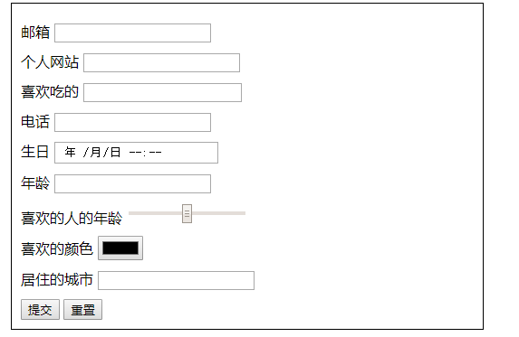

#### 10.1.1  常见输入类型

```
text password radio checkbox button file hidden submit reset image
```

#### 10.1.2  新的输入类型

- email 邮箱
- url 网址
- search 搜索
- tel 电话 
- 日期等
  - date
  - time
  - datetime
  - datetime-local
  - month
  - week
- number 数字输入框
  - min 最小值
  - max 最大值
  - step 步数
- range 范围
  - min 最小值
  - max 最大值
  - step 步长
- color 颜色
  - 标签的 value 属性中写颜色值只能写这格式 `#000000`
- datalist 可输入表单


### 10.2  h5表单属性

- placeholder:占位符-提示信息
- autofocus:自动获得焦点-一般页面中放1个
- autocomplete 自动完成
  - 当用户在字段开始键入时，浏览器基于之前键入过的值，应该显示出在字段中填写的选项。
  - 默认已经打开 如 `autocomplete=on`  关闭 `autocomplete =off`
  - 需要放在表单内同时加上name属性
- multiple:可以多选文件提交
  - 结合文件上传标签   `<input type="file" >`   一起使用
- form属性，可以将输入标签放在表单的外面，还受到表单的管理 

```html
<!-- 指定了id为ff -->
<form action="" id="ff" >
  <input type="submit" value="提交">
</form>
<!-- 指定了属性form，值为表单的id=ff -->
<input type="text" required form="ff"  >
```

- required:必填验证
- novalidate:关闭验证
  - 在表单上添加该属性，那么在提交的时候就不会再执行 required验证
- pattern：自定义验证-通过编写正则表达式自定义验证规则 一般和required同时使用
  - 表单事件

### 10.3  h5表单事件

- oninvalid  当元素表单验证失败时触发 
  - 可以通过`this.setCustomValidity("自定义验证提示")` 代码自定义验证提示
- oninput 当输入值的时候触发
- oncontextmenu  鼠标右键事件

# H5第6天

## 1  学习目标

- 理解

  - 多媒体标签
  - 本地存储
  - 网络状态（了解）
  - 全屏（了解）
  - 文件读取api（了解）
  - 拖拽（了解）
  - 地理位置（了解）
  - h5兼容处理
  - css3浏览器前缀以及处理
- 应用

  - 自定义多媒体播放器
  - 本地搜索历史


## 2  h5 的兼容处理

### 2.1  h5语义化标签兼容

一些低版本的浏览器是不支持h5语义化标签的，如header标签`<header>ie8不识别</header>`,在ie8下将header标签识别为普通的行内元素，可将一下代码放在谷歌和ie8以下测试

```html
<!DOCTYPE html>
<html lang="en">

<head>
  <meta charset="UTF-8">
  <title>Document</title>
  <style>
    header {
      background-color: red;
    }
  </style>
</head>

<body>
  <header>大头大头下雨不愁</header>
</body>

</html>
```

现在要做的是在ie8下识别他们（坑）

### 2.2  解决

1. 在header标签中，加入一段js

`document.createElement("header")`header可以替换为你需要的标签

2. 在style中，给要兼容的标签加上对应的设置，如块级则：`display:block;`行内则display:inline;等

```html
<!DOCTYPE html>
<html lang="en">

<head>
  <meta charset="UTF-8">
  <title>Document</title>
  <style>
    header {
      background-color: red;
      /* 2.0 header为块级元素 */
      display: block;
    }
  </style>
  <script>
    /* 1.0  创建一次header标签即可 */
    document.createElement("header");
  </script>
</head>

<body>
  <header>大头大头下雨不愁</header>
</body>

</html>
```

## 3  html5shiv.js

在工作中，由于要兼容的标签比较多，不可能都是我们手动的处理，因此可以引用一个js文件，它的作用就是完成了上述的两个步骤的


### 3.1  在线地址

[html5shiv.js](https://cdn.bootcss.com/html5shiv/r29/html5.js)  如果失效，可自行百度即可。

### 3.2  使用方法

直接在head标签中引入即可

### 3.3  条件注释

对此解决步骤在做到细化，html5shiv.js只应该在某些低级浏览器中才会下载，某些高级版本的浏览器（如谷歌）是不应该下载该文件的，想要做到这个功能，最简单和常用的就是使用**条件注释**


### 3.4  语法

```html
<!--[if IE]>用于 IE <![endif]-->
<!--[if IE 6]>用于 IE6 <![endif]-->
<!--[if IE 7]>用于 IE7 <![endif]-->
<!--[if IE 8]>用于 IE8 <![endif]-->
<!--[if IE 9]>用于 IE9 <![endif]-->
<!--[if gt IE 6]> 用于 IE6 以上版本<![endif]-->
<!--[if lte IE 7]> 用于 IE7或更低版本 <![endif]-->
<!--[if gte IE 8]>用于 IE8 或更高版本 <![endif]-->
<!--[if lt IE 9]>用于 IE9 以下版本<![endif]-->
<!--[if !IE]> -->用于非 IE <!-- <![endif]-->
```

测试

```html
<!--[if lte IE 8]> <script >alert("ie8以及以下会被执行");</script> <![endif]-->
```

用法

```html
<!--[if lte IE 8]> <script src="https://cdn.bootcss.com/html5shiv/r29/html5.js"></script> <![endif]-->
```

##  4  css3兼容处理

css3涉及到较多的新属性，某些低版本（如ie8及以下）的浏览器对css3的技术支持程度不够，因此需要做以下处理

添加对应的浏览器的前缀，常见前缀如下

- 谷歌 -webkit
- 火狐 -moz
- IE -ms

如对`border-radius`进行兼容处理

```css
-webkit-border-radius: 30px 10px;
-moz-border-radius: 30px 10px;
-ms-border-radius: 30px 10px;
// border-radius 一定要放在最后
border-radius: 30px 10px;
```

如果发现添加前缀也解决不了兼容性问题，那么就不要使用该css3属性